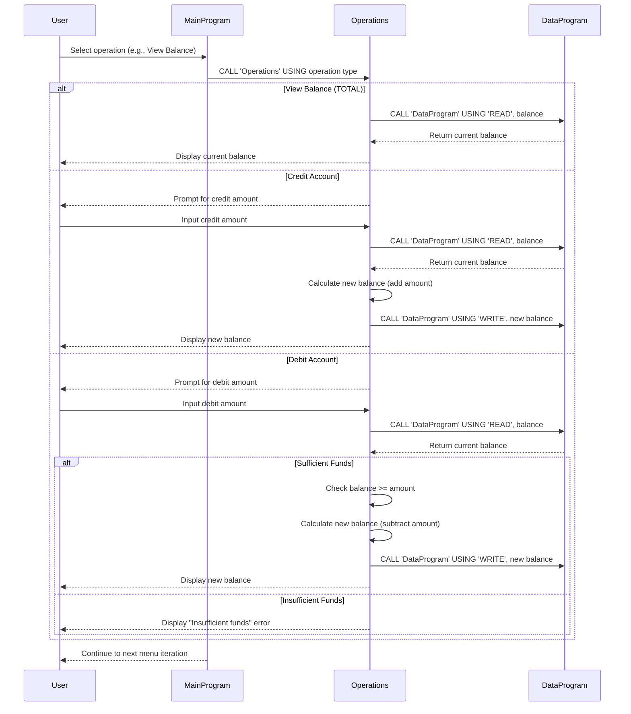

# COBOL Student Account Management System Documentation

This repository contains a legacy COBOL-based system for managing student accounts. The system allows users to view balances, credit accounts, and debit accounts with basic validation.

## COBOL Files Overview

### `src/cobol/data.cob`

**Purpose:**  
This program serves as a data storage module for the student account balance. It provides a simple interface for reading and writing the account balance to persistent storage.

**Key Functions:**

- `READ`: Retrieves the current balance from storage.
- `WRITE`: Updates the balance in storage with a new value.
- Uses a linkage section to pass operation type and balance values between programs.

**Business Rules:**

- Maintains a single balance value (initially set to $1000.00).
- No validation on balance updates beyond basic data type constraints.

### `src/cobol/main.cob`

**Purpose:**  
This is the main entry point of the student account management system. It provides a user interface for interacting with the account operations through a menu-driven console application.

**Key Functions:**

- Displays a menu with options for account operations.
- Accepts user input for operation selection.
- Calls the `Operations` program based on user choice.
- Handles program exit when user selects option 4.

**Business Rules:**

- Supports four operations: View Balance (1), Credit Account (2), Debit Account (3), Exit (4).
- Loops until user chooses to exit.
- Validates menu choices and displays error for invalid selections.

### `src/cobol/operations.cob`

**Purpose:**  
This program handles the core business logic for account operations including viewing balance, crediting, and debiting amounts from student accounts.

**Key Functions:**

- `TOTAL`: Displays the current account balance.
- `CREDIT`: Adds a specified amount to the account balance.
- `DEBIT`: Subtracts a specified amount from the account balance (with validation).
- Interacts with `DataProgram` for balance storage operations.
- Prompts user for amounts during credit/debit operations.

**Business Rules:**

- **Insufficient Funds Check:** Debit operations are only allowed if the current balance is greater than or equal to the debit amount. If insufficient funds, the operation is rejected with an error message.
- No upper limit on credits or balance amounts.
- All amounts are handled as decimal values with 2 decimal places (PIC 9(6)V99).
- Balance updates are immediately persisted through the data module.

## System Architecture

The system follows a modular design with three separate programs:

1. **MainProgram** (`main.cob`) - User interface and program flow control
2. **Operations** (`operations.cob`) - Business logic for account transactions
3. **DataProgram** (`data.cob`) - Data persistence layer for balance storage

Programs communicate through COBOL's `CALL` statement and linkage sections, allowing for modular development and maintenance.

## Business Rules Summary

- Student accounts maintain a single balance value.
- Credits can be applied without restrictions.
- Debits require sufficient balance to prevent overdrafts.
- All transactions are processed immediately with real-time balance updates.
- Initial balance is set to $1000.00 for demonstration purposes.

## Sequence Diagram

The following sequence diagram illustrates the data flow for a typical account operation (e.g., viewing balance or performing a credit/debit transaction):

